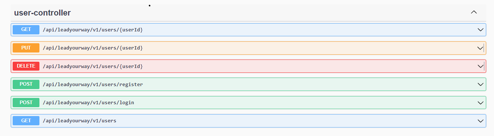
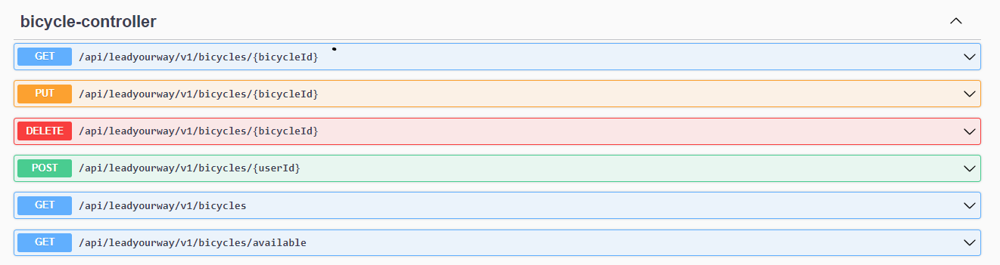
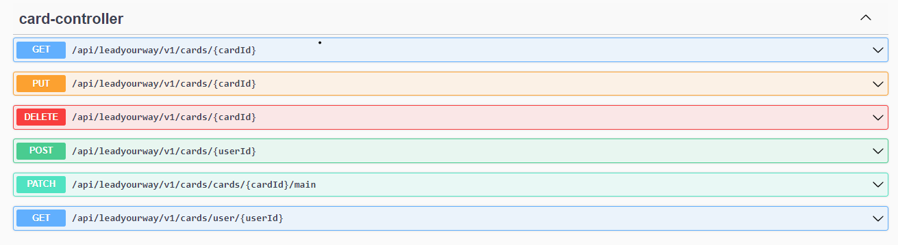
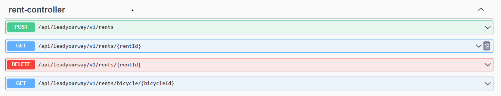
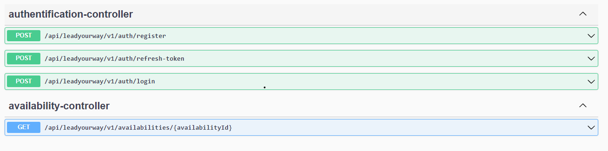

<div align="center">
  
  <h3 align="center">Lead Your Way - Bike Rental App</h3>
  <p>Navi Buddy · 2023-02</p>
</div>

---

Welcome to **Lead Your Way** , your go-to bike rental app for a convenient, efficient, and enjoyable cycling experience.

## About Lead Your Way

Lead Your Way is a digital platform designed to simplify bike rentals for all types of cyclists. Whether you're a sports enthusiast looking for a thrilling ride or someone in need of efficient urban mobility, our app offers a wide range of features and benefits to enhance your cycling journey.

## Table of Contents

-   [Authors](#authors)
-   [Installation](#installation)
-   [Usage](#usage)
-   [API Documentation](#api-documentation)

## Authors

This project was developed by a team of software engineering students from Universidad Peruana de Ciencias Aplicadas:

-   [Oliver Tuesta](https://github.com/oliverTuesta) - GitHub: oliverTuesta
-   [Andres Leiva](https://github.com/aleiva17) - GitHub: aleiva17
-   [Lorenzo Navarro](https://github.com/coderinzler) - GitHub: coderinzler
-   [Josue Ramos](https://github.com/Blo0m) - GitHub: Blo0m
-   [Lucas Ruiz](https://github.com/lucas1336) - GitHub: lucas1336

## Installation

Follow these steps to set up and run the Learn Your Way Spring Boot application:

1. Clone the repository to your local machine:

```
git clone https://github.com/Navi-Buddy/lead-your-way-api.git
```

2. Open it in your IDE of choice (we recommend IntelliJ IDEA).

3. Change the database connection properties in the `application.properties` file to match your local database configuration:

```
spring.datasource.url=jdbc:mysql://localhost:3306/lead_your_way?useSSL=false&serverTimezone=UTC
spring.datasource.username=root
spring.datasource.password=root
```

4. Run the application.

The application will start on `http://localhost:8080`.

## Usage

To use Learn Your Way, you can interact with the API endpoints to manage user profiles, courses, and learning resources. You can make API requests using tools like `curl` or Postman.

## API Documentation

Learn Your Way uses Swagger UI to document the API endpoints. You can access the Swagger UI documentation at `http://localhost:8080/swagger-ui.html`.

Here is a preview of the API documentation:







Swagger UI will provide a user-friendly interface for exploring and testing the API endpoints.

Feel free to explore the API documentation to understand the available endpoints and their functionality.
